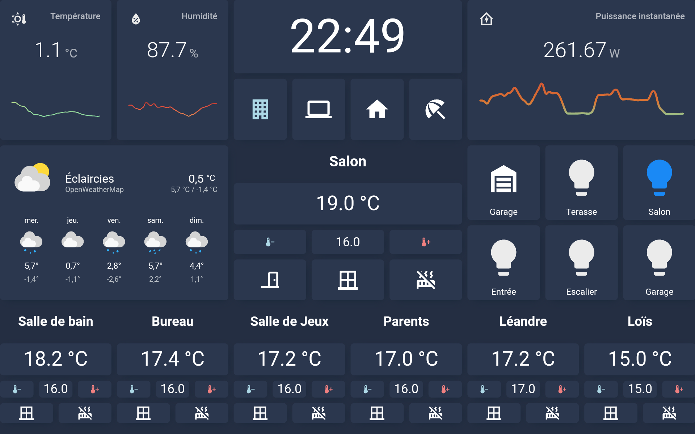
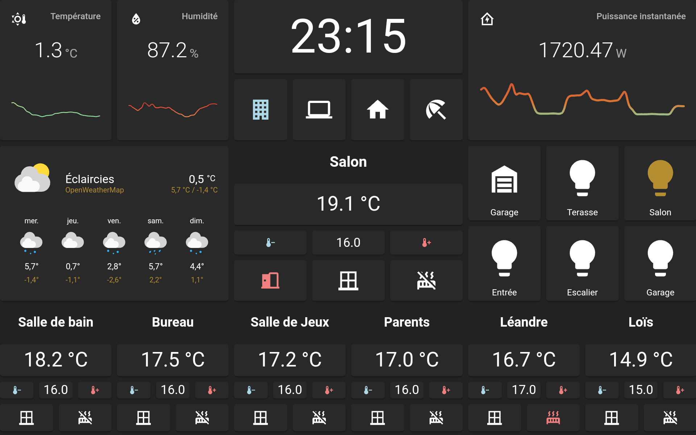

# Home Assistant

Here is my Home Assistant configuration and some usefull informations like the integrations or add-on I use.

# Add-On

**available soon**

# Integrations

**available soon**

# Lovelace
## Themes

**available soon**

## HACS custom cards

**available soon**

## Screenshots
### Tablet (single/full page)

*Noctis Theme*

*Slate Theme*

### Mobile

**available soon**

### Desktop

**available soon**